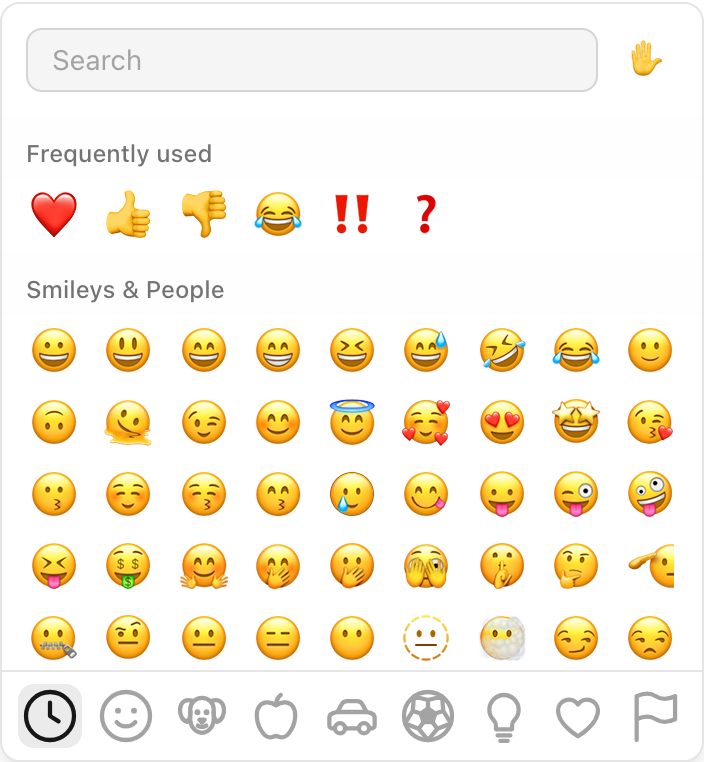

<div align="center">
  <h1>Emoji Picker</h1>
  <a href="https://emoji.brianhung.me">
    <picture>
      <source media="(prefers-color-scheme: dark)" srcset=".github/assets/picker-dark.png">
      
    </picture>
  </a>
  <p>A virtualized, unstyled, and composable emoji picker for React.</p>
  <p><a href="https://emoji.brianhung.me">Docs</a> · <a href="https://emoji.brianhung.me/gallery/">Gallery</a> · <a href="https://emoji.brianhung.me/examples/">Examples</a></p>
</div>

## Installation

### shadcn/ui

```bash
npx shadcn@latest add https://emoji.brianhung.me/r/emoji-picker.json
```

```tsx
import { EmojiPickerCard } from "@/components/ui/emoji-picker";

<EmojiPickerCard onSelect={(selection) => insert(selection.emoji)} />
```

### npm

```bash
npm i @brianhung/emoji-picker-react
```

## Usage

```tsx
import { EmojiPicker } from "@brianhung/emoji-picker-react";

<EmojiPicker.Root onSelect={(selection) => insert(selection.emoji)}>
  <EmojiPicker.Search />
  <EmojiPicker.Viewport>
    <EmojiPicker.List />
  </EmojiPicker.Viewport>
</EmojiPicker.Root>
```

## Packages

| Package | Description |
|---|---|
| [`@brianhung/emoji-picker-react`](packages/react/README.md) | React parts and hooks |
| [`@brianhung/emoji-picker-core`](packages/core/README.md) | Data, search, and state, with no dependencies |
| [`@brianhung/emoji-picker-data`](packages/data/README.md) | Datasets for every Emojibase locale and shortcode set; core loads its English one by default |
| [`@brianhung/emoji-picker-twemoji-font`](packages/twemoji-font/README.md) | Twemoji as a COLRv0 color font for the native renderer |

[Contributing](CONTRIBUTING.md)

## License

MIT. Third-party notices are in [THIRD_PARTY_NOTICES.md](THIRD_PARTY_NOTICES.md).
