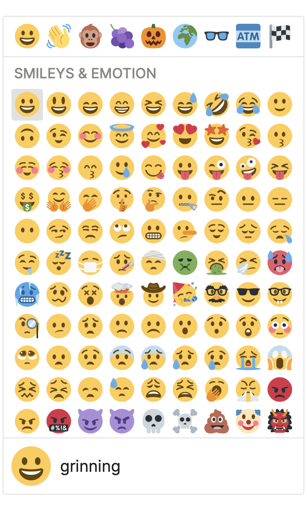
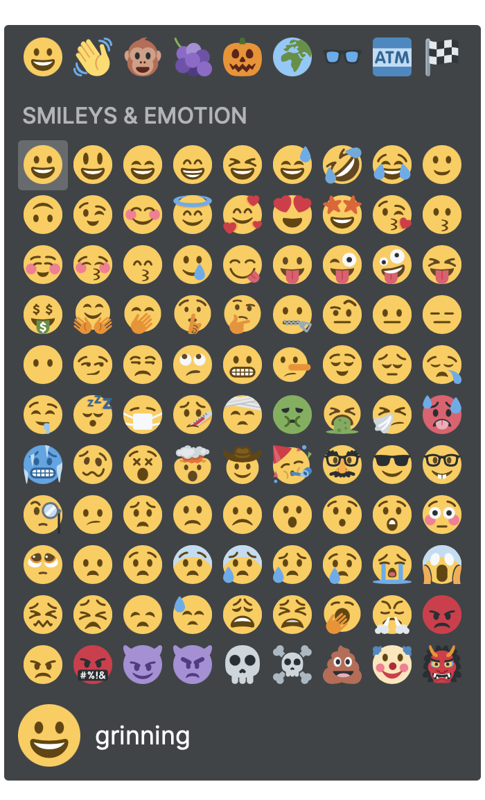

<div align="center">
  <br><b>React Twemoji Picker</b> is an emoji component
  <br>made for fast show-and-scroll and filtering
  <br><a href="https://brianhung.github.io/EmojiPicker">demo</a>
  <br><a href="https://brianhung.github.io/EmojiPicker"></a>
  <br><a href="https://brianhung.github.io/EmojiPicker"></a>
</div>

To do this, we virtualize emoji elements with [`react-window`](https://github.com/bvaughn/react-window) 
and [`react-window-infinite-loader`](), meaning elements are not rendered into the DOM until they 
are visible through the scroll viewport. This allows [`react-twemoji-picker`](https://github.com/BrianHung/EmojiPicker) to be used with input or contenteditable components which require fast responsivity.

Original svg sources for emoji spritesheet comes from Twitter's [`twemoji`](https://github.com/twitter/twemoji) library. 😊

## Installation

```bash
npm install --save github:brianhung/emojipicker
```

## Usage

```js
import { EmojiPicker } from 'react-twemoji-picker';
import EmojiData from "react-twemoji-picker/data/twemoji.json";

const emojiData = Object.freeze(EmojiData)
const handleEmojiSelect = (emoji: EmojiObject) => console.log(emoji)

<EmojiPicker emojiData={emojiData} handleEmojiSelect={handleEmojiSelect}/>
```

If you want to programatically get or set internal state (e.g. `search`), you have to use `EmojiPickertRef` 
since `EmojiPicker` is a functional component. As an example,

```jsx
import { EmojiPicker, EmojiPickerRef } from 'react-twemoji-picker';
const ref = React.createRef<EmojiPickerRef>()
const handleSearch = (query: string) => ref.current.search(query);
<EmojiPicker emojiData={emojiData} handleEmojiSelect={handleEmojiSelect} ref={ref}/>
<input onChange={event => handleSearch(event.target.value)} placeholder="search"></input>
```

To see an example, look at the <a href="./website/index.tsx">source code</a> for the demo.

### Props

| prop | default | description |
|:-----|:--------|:------------|
| emojiData: Record<string, EmojiObject[]> | `{}` | map of categories to list of emoji objects |
| emojiSize?: number | `36` | pixel size of an emoji |
| numberScrollRows?: number | `12` | number of rows in the scroll element |
| onEmojiSelect?: (emoji: EmojiObject, event: KeyboardEvent | MouseEvent) => void, | `(emoji: EmojiObject) => console.log(emoji)` | handle emoji click or enter key here |
| showNavbar?: boolean; | `false` | allows navigation to categories |
| showFooter?: boolean; | `false` | show focused emoji and its name |
| showScroll?: boolean; | `true` | turn off if query is always not null |
| emojisPerRow?: number; | `9` | number of emojis to show per row |
| onKeyDownScroll?: Function; | `(event) => null` | handle additional key events like 'ctrl-c' here |
| collapseCategoriesOnSearch?: boolean; | `true` | merge categories into single 'search results' category |
| collapseHeightOnSearch?: boolean; | `true` | scroll height changes with number of emojis |
| theme?: "system", "light", "dark" | `"system"` | css theme |